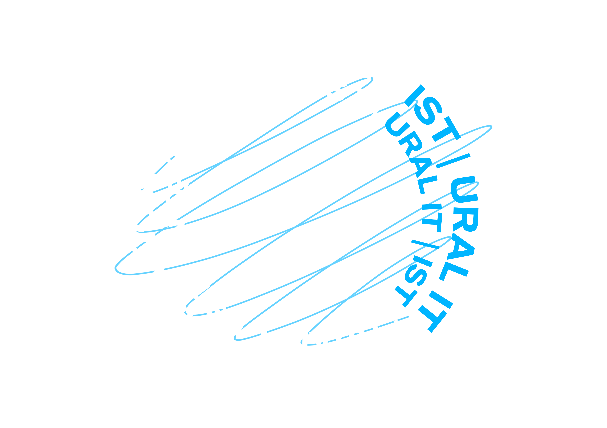

# Geek Bot by IIntegration

## Описание задачи
> Для повышения эффективности обучения и улучшения качества программ требуется обрабатывать большой объем обратной связи. Для этого необходимо разработать прототип системы для интеллектуального анализа обратной связи студентов. Система должна включать в себя чат-бота для сбора данных от студентов и алгоритмы искусственного интеллекта для обработки и классификации полученной информации. Чат-бот задает студентам открытые вопросы после вебинаров и сессий, собирая ответы в текстовом формате. Далее алгоритмы ИИ анализируют собранные ответы, выделяя ключевые моменты и классифицируя их на информативные и неинформативные, а также на положительные и отрицательные отзывы.
При оценке решения будет учитываться не только точность и эффективность алгоритмов ИИ в классификации обратной связи, но и понятность результатов для преподавателей и методистов. Особое внимание будет уделено качеству визуализации данных и легкости их интерпретации, что позволит экспертам более эффективно использовать аналитику для улучшения качества образовательных программ.
Метрика как технический критерий, лидерборд будет.

## ML часть
Необходимо было реализовать `Pipeline`, который предсказывает результаты по столбцам `"is_relevant", "object", "is_positive"`
- `"is_relevant"` - релевантен ли отзыв. 1 - да, 0 - нет.
- `"object"` - к кому направлен отзыв. 0 - вебинар, 1 - программа, 2 - преподаватель.
- `"is_positive"` - позитивен ли отзыв. 1 - да, 0 - нет.

Данные имели сильный дисбаланс классов, а также данных было очень мало (103 экземпляра). Поэтому необходимо было реализовать аугментацию данных.

При разработки `Pipeline` ML части были выдвинуты следующие гипотезы:
- [x] Модель XX и использование английского дало неплохой результат **Стабильный результат**
- [X] Попробовать модель для русского языка **Получилось хуже**
- [x] Попробовать получать векторное представление [LLM](https://huggingface.co/ai-forever/sbert_large_nlu_ru) **Точно такой же как и spacy**
- [x] Аугментация. Попробовать различные комбинации вопросов 1 с 2, 1 с 3

В результате пришли к выводу, что будем использовать модель `Spacy`. При разработки Pipeline `Spacy` была теория вместо `tok2vec` использовать модель transformer `sbert_large_nlu_ru`. Но при тестировании  оказалось, что модель модель `tok2vec` оказалась лучше по критериям скорости и точности. Поэтому мы решили дальше решили использовать компоненты `tok2vec`, `textcat`.

## Backend часть

## Web часть